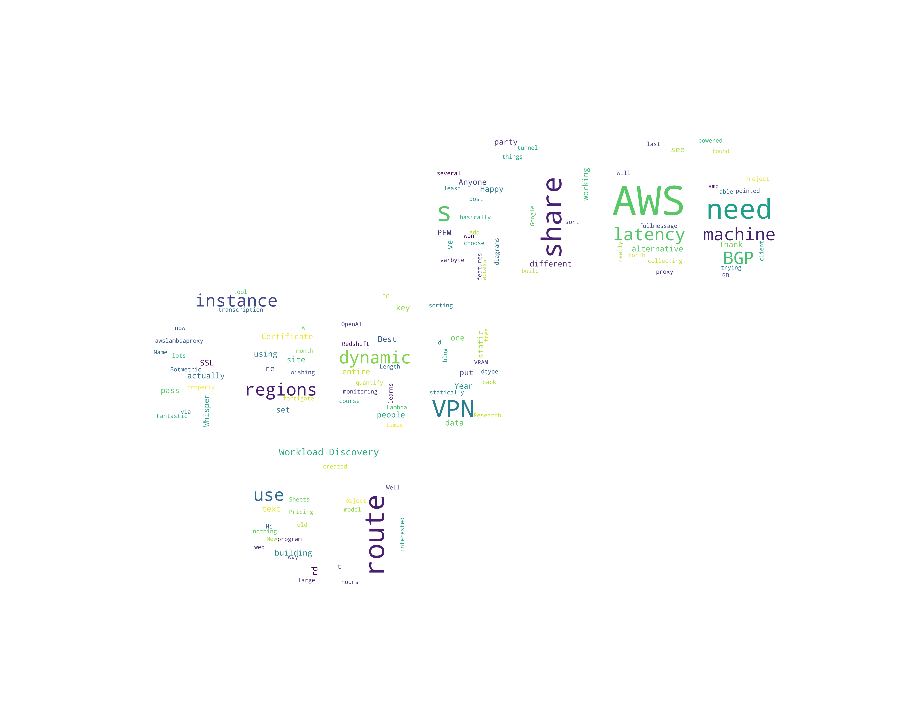
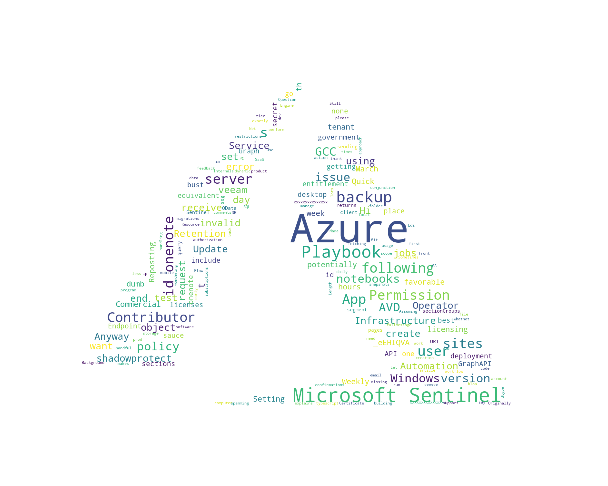
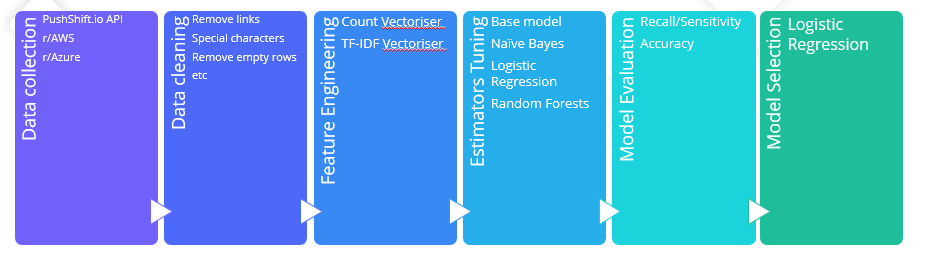
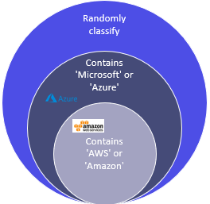
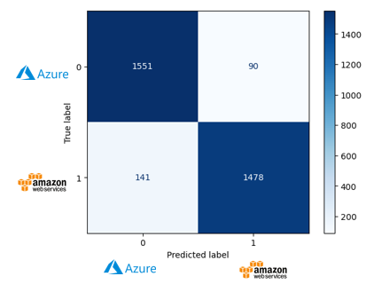
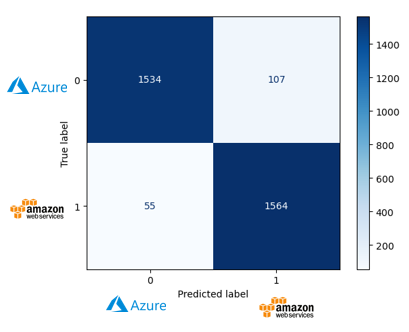
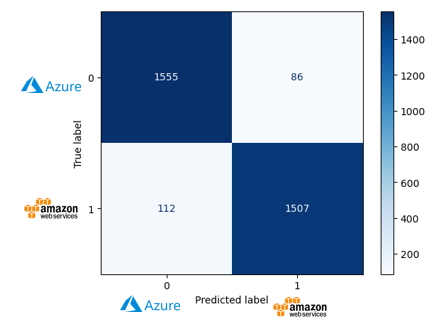
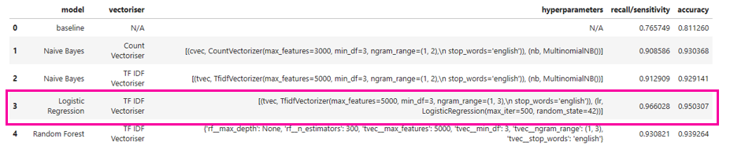
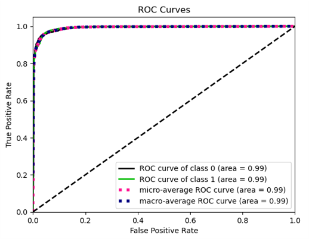

# GA DSI Project 3: Splitting Clouds - An NLP Project to classify AWS and Azure subreddit posts

This project aims to apply web scraping and NLP concepts to classify comments related to AWS and Azure cloud services under General Assembly DSI course. 

# Table of contents
1. [Project Description](#1-project-description)  
    1.1. [Problem Statement](#11-problem-statement)  
    1.2. [Background](#12-background)  
    1.3. [Data](#13-data)   
    1.4. [Overview](#14-overview)   
2. [Results and learnings](#2-results-and-learnings)  
    2.1. [Training and evaluation results](#21-training-and-evaluation-results)  
    2.2. [Model Selection and Conclusion](#22-model-selection-and-conclusion)  
 

# 2. Project Description
[[back to the top]](#table-of-contents)

## 1.1. Problem Statement ##
[[back to the top]](#table-of-contents)

This case study shows how to create a model for **text classification** to automatically **classify incident tickets for different cloud services**. 
* In this project, we face the cold start issue of creating a machine learning model to classify request tickets, by making use of publicly available data in subreddits. 
* This model aims to automate the categorisation of IT requests raised for a company utilizing both AWS and Azure services. 
* Reduce time for the relevant DevOps or support team to respond.

## 1.2. Background ##
[[back to the top]](#table-of-contents)

In our scenario, a hypothetical e-commerce company utilise services provided by both cloud services to handle the backend of their internet-facing web application and mobile app. Cloud technologies decouples components of computers into different services based on a on-demand or subscription pricing model. This helps to lower the barrier of entry and provides access to computing resources at a fraction of the price for running expensive computations and to experiment POCs.   

Azure and AWS offers a myriad of cloud services and many are similar with one another, but their different naming can make differentiation difficult. A rough comparison below:  

|Cloud Service|AWS|Azure|
|---|---|---|
|Virtual Servers|Instances|VMs|
|Docker Management|ECS|Container Service|
|Object Storage|S3 Bucket|Azure Blob|
|Kubernetes|EKS|AKS|
|Files|EFS|Azure Files|
|Content Delivery|CloudFront|CDN
|Data Warehouse|Redshift|SQL Warehouse|
|IoT|AWS IoT|Azure IoT|
|Data Stream|AWS Kinesis|Azure Event Hub|
|Data Lake|AWS S3|Azure Data Lake|
|ETL|AWS Glue|Azure DataBricks|
|ML|AWS SageMaker|Azure ML|
|Serverless|AWS Lambda|Azure Function|
|API|API Gateway|Azure API Management|

 

## 1.3. Data ##    
[[back to the top]](#table-of-contents)

- For this project, data have scraped 5000 posts from r/aws and r/azure each using pushshift API.  
- Training data size: 6000+.  
- Testing data size: 3000+.  

They are saved in csv format as follows:  
[AWS subreddit posts](data/aws_subreddit.csv)  
[Azure subreddit posts](data/az_subreddit.csv)  

Original Features:   

|Feature|Description|Type|
|---|---|---|
|subreddit|classification of the subreddit|string|
|author|username of reddit user|string|
|title|Title of the post |string|
|selftext|Description of the post |string|
|utc_datetime_str|Timestamp when post is created|string|

Word Cloud after cleaning data:  
  
  

## 1.4. Overview ##    
[[back to the top]](#table-of-contents)

 

# 2. Results and learnings
[[back to the top]](#table-of-contents)

## 2.1. Training and evaluation results ##
[[back to the top]](#table-of-contents)

Feature engineering to prepare the predictors:
1. Count Vectoriser
2. TF-IDF Vectoriser improves on Count Vectoriser. Similar to Count Vectoriser, in taking frequency of words, but places less emphasis on common words. 

 

The baseline model is a simple model that checks if keyword "Aws" and "Azure" exists in the post to determine the post classification.  
  

Estimators for tuning and training to improve on the baseline model:   
1. Naive Bayes
* We vectorise the text into a frequency vector before passing it into a Naive Bayes model for classification. 
* Naive Bayes classifier is based on features being independent of one another. 
* Here we use Multinomial Naive Bayes classifier for document classification, to see which comment belong to Aws or Azure category.

  

2. Logistic Regression
* The logistic regression has multiple independent variables determined by text transformed by the TF-IDF vectoriser, where each feature will be assigned a coefficient.

  

3. Random Forests
* A random forest model is made up of multiple decision trees.
* Each tree is trained from a sample subset of the data with replacement (bootstraping).
* Each decision tree will be less correlated due to feature bagging.

  

## 2.2. Model Selection and Conclusion ##
[[back to the top]](#table-of-contents)

  

* The priority is to classify AWS services related requests to be routed to company’s support and DevOps team for triaging and response. 
* Logistic Regression model is selected as it has the highest TPR of 0.966.

  
* Model have a good chance of distinguishing between 2 classes. AUC (Area under curve) is 0.99, indicating less overlap of the classes.

Conclusion:
* By using Logistic Regression, we can improve classification accuracy of AWS related IT request to the correct support team from 81% to 96%.
* Time saved in handshaking IT requests between different teams. 

Future Exploration:  
1. Adding a more granularity to the category to predict for more fine tuned requests routing to support, DevOps team. 
2. Feeding AWS and Azure documentation corpus into the machine learning model for a more comprehensive coverage.
3. Additional derived features might give some insights to priority of the content.

 

